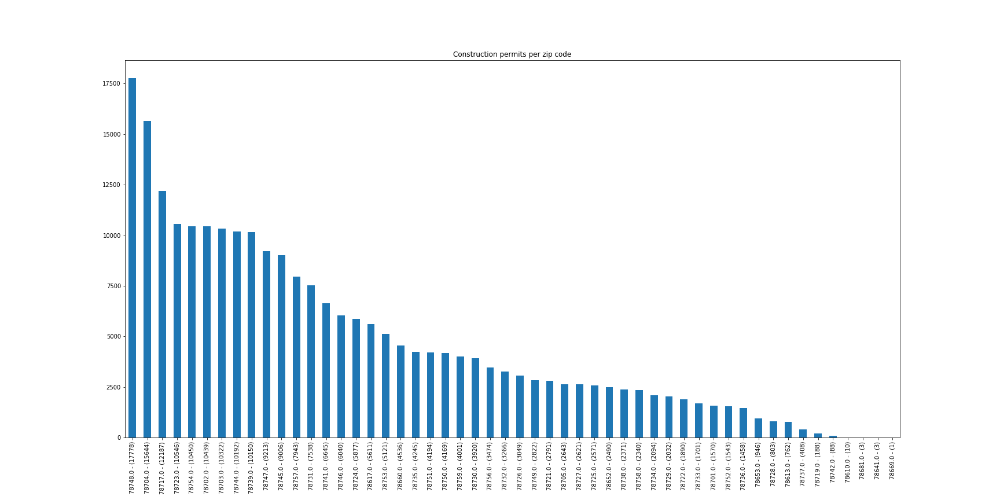
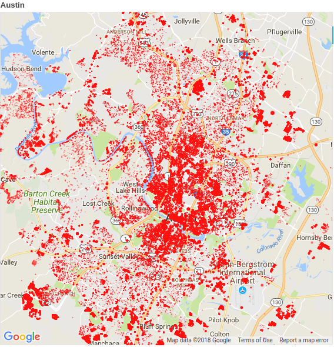

# Forecasting real estate growth and densification in Austin by zip code.

#### Author: Scott Kurland
#### January 2018 Galvanize Data Science Immersive

## Background and Motivation:

Over a hundred people move to Austin every day. Predicting the shape and density of the city has practical applications regarding utilities and infrastructure, as well as implications for development and design. Current laws enforcing 40' front yard depth make sprawl inevitable, for example, trading density for aesthetics. Austin will grow from its current size of 950,000 people and 272 square miles. There is room to grow into the Austin metropolitan area of 4,300 square miles and a population of over 2 million people.

### Data project:

#### Data pipeline: 
The data is from the city of Austin's Open Data Portal. It consists of over 1.8 million construction permits from the period 2010-2017, and is roughly a gigabyte. I chose to use construction permit data because it is updated daily rather than, for example, census data. The tools that I used are primarily from Anaconda Python: pandas, matplotlib, numpy, scipy, scikit-learn, supplemented with Amazon Web Services (AWS) EC2 and S3.

#### Exploratory Data Analysis (EDA)

Cleaning the dataset, e.g. eliminating rows without added square footage, provided over 241 thousand rows of good data from a sparse dataset of over 1.8 million rows. Plotting various fields against location and time data identified important features like NumberOfFloors. I speculated that using added square footage as a proxy for population may correlate as or more strongly with measures reflecting the need for infrastructure.

EDA revealed that the most important fields were location based (including zip code, latitude, longitude),  and added square feet,  although fields like the number of floors also offered insight. One additional interesting result that showed up in the EDA was the presence of zero-story projects e.g. parking lots.

### Results

The zip codes with the most construction and consequent increased infrastructure needs were, in millions of square feet:

- 78701: Downtown       106
- 78704: Near South     89
- 78758: North          75
- 78748: Far South      70
- 78744: Southeast      60

In total, 1,309,787,870 square feet were added to 52 zip codes, for an average add of 25,188,228 square feet and a standard deviation of 27,290 square feet.

I modeled the data with a hundred tree random forest regressor. RF performance evaluated well, with an R squared value of 0.72. This is strong enough to predict measures of infrastructure needs like electricity, water, and data. A monthly time series split returns an R squared value of 0.66.

My presentation comprising six slides and a three minute talk including summary of data scoring is available here, as well as a Jupyter Notebook with more EDA. The data is open source, available online at the city of Austin Open Data Portal, and updated regularly.

## Future questions:

How much detail of construction projects can be inferred from open source data, e.g. infrastructure and construction permits? How closely can revenue, e.g. rent, be inferred from same in addition to neighborhood revenue data scraped from e.g. Zillow? Several websites have promising data and features to mine for forecasting e.g. www.zillow.com, www.trulia.com, www.redfin.com, www.opendoor.com, www.mashvisor.com, www.housingrebound.com, www.housecanary.com, and www.easyatlas.com.

HouseCanary comes closest to the opportunity that I see to predict changes in valuation due to new construction, infrastructure, subdivisions, even rare-in-Austin upzoning.

## References

2010 Census of Population and Housing, Population and Housing Unit Counts, CPH-2-5. U.S. Government Printing Office, Washington, DC: U.S. Census Bureau. 2012.

"Seeing like a state: How Certain Schemes to Improve the Human Condition Have Failed" by James C. Scott, Publisher : Yale University Press

